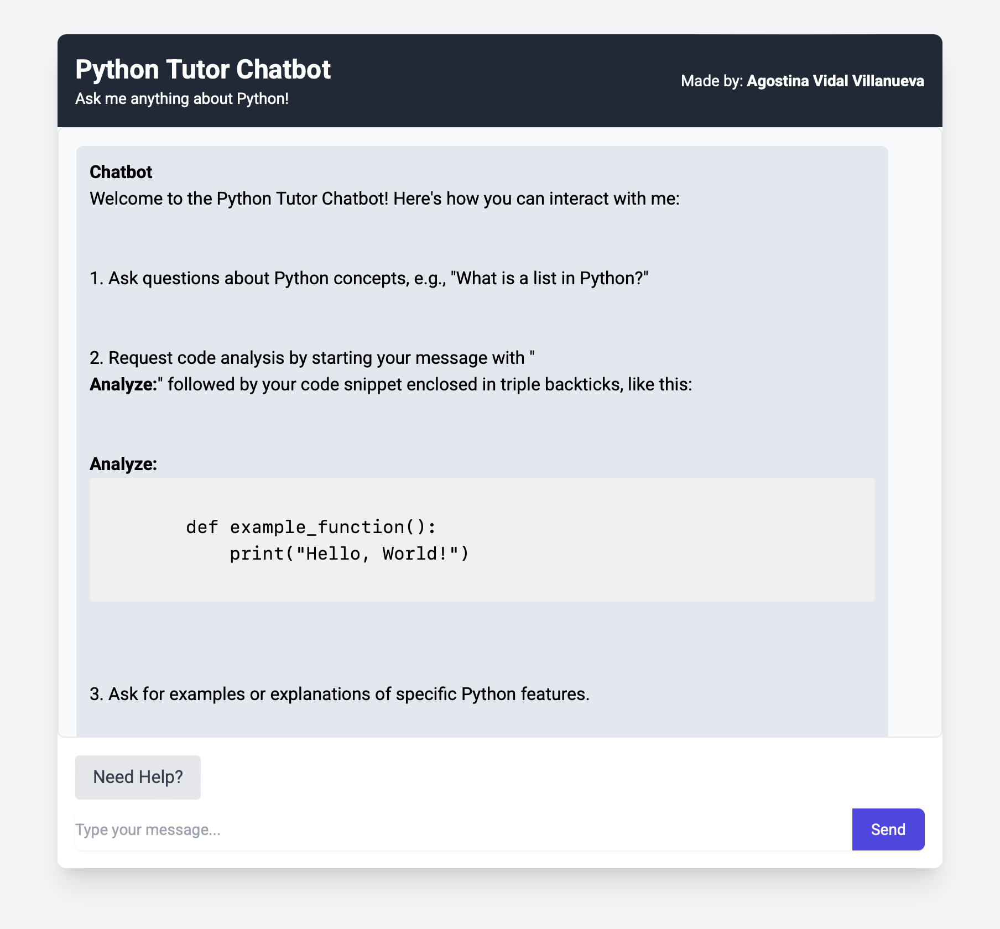
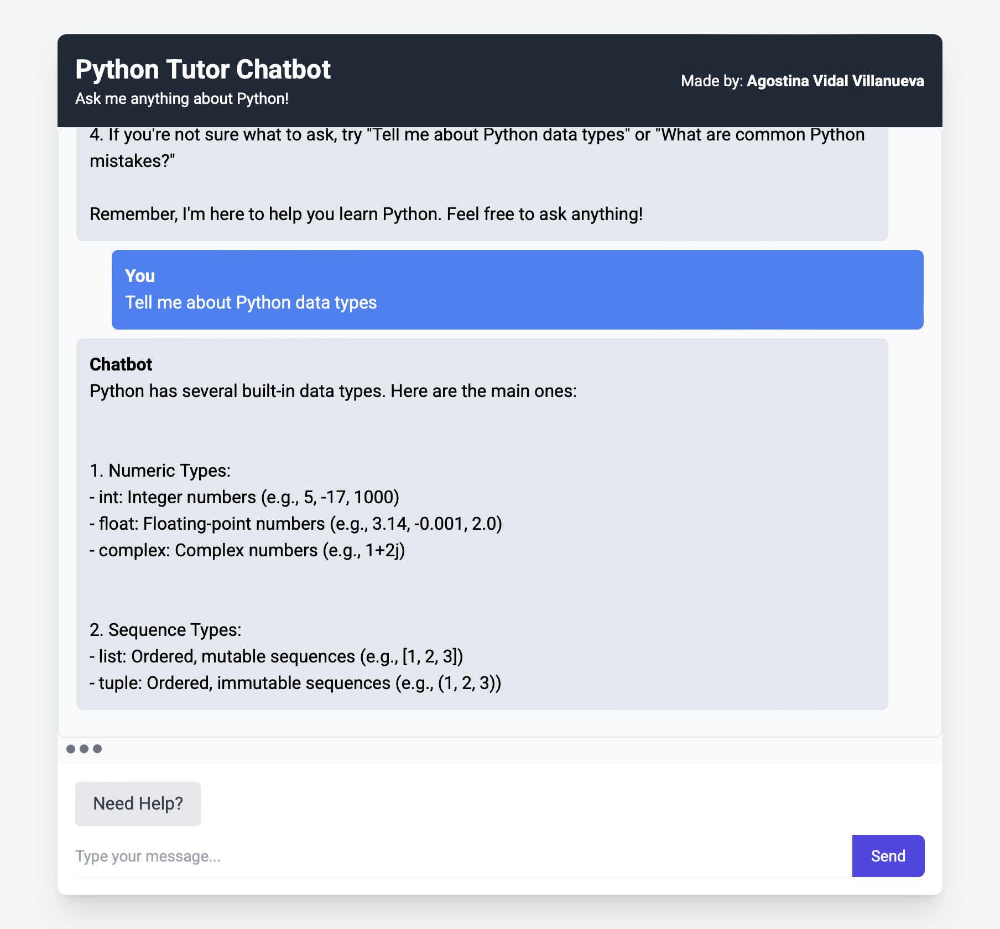

# Python Tutor Chatbot

An interactive web-based chatbot designed to assist users in learning Python. It responds to user queries about Python concepts, provides code analysis, and offers explanations on common programming mistakes.

## Live Demo

👉 [Click here to try the app](https://python-tutor-chatbot-36ad1a4c04c6.herokuapp.com)

## Motivation

The Python Tutor Chatbot was developed to provide an accessible and interactive platform for individuals learning Python. By simulating a conversational tutor, it aims to make the learning process more engaging and responsive to individual queries.

## ⚙️ Tech Stack

- Python: Core programming language used for development.
- Flask: Web framework for handling routes and rendering templates.
- NLTK: Natural Language Toolkit for processing and understanding user inputs.
- HTML/CSS: Frontend structure and styling.
- Heroku: Deployment platform for hosting the web application.

## 📁 Project Structure

├── static/                  # CSS and static assets
├── templates/               # HTML templates
├── assets/                  # Images of the live demo
├── app.py                   # Flask application
├── chatbot.py               # Chatbot logic and response generation
├── download_nltk_data.py    # Script to download necessary NLTK data
├── requirements.txt         # Python dependencies
├── Procfile                 # Heroku deployment configuration
└── README.md                # Project documentation

## Key Features

- Conversational Interface: Engages users in a dialogue to answer Python-related questions.
- Code Analysis: Evaluates user-provided code snippets and offers feedback.
- Error Explanation: Identifies common programming mistakes and explains them in simple terms.
- Educational Guidance: Provides explanations on Python concepts to aid learning.

## Preview

## 🔧 Installation

To run this project locally:

Clone the repository:

git clone https://github.com/wgstna/python_tutor_chatbot_portfolio.git

cd python_tutor_chatbot_portfolio

Install dependencies:

pip install -r requirements.txt

Download NLTK data:

python download_nltk_data.py

Run the application:

python app.py

Access the chatbot:

Open your browser and navigate to http://localhost:5000

## License

This project is licensed under the MIT License.

## 🌐 More Information

For a detailed explanation of the project's development and features, visit the project page on my website.

👉 [Click here for the portfolio page](https://agostinavidalvillanueva.com/python_chatbot.html)
